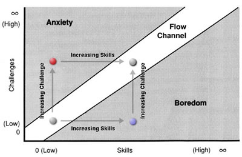
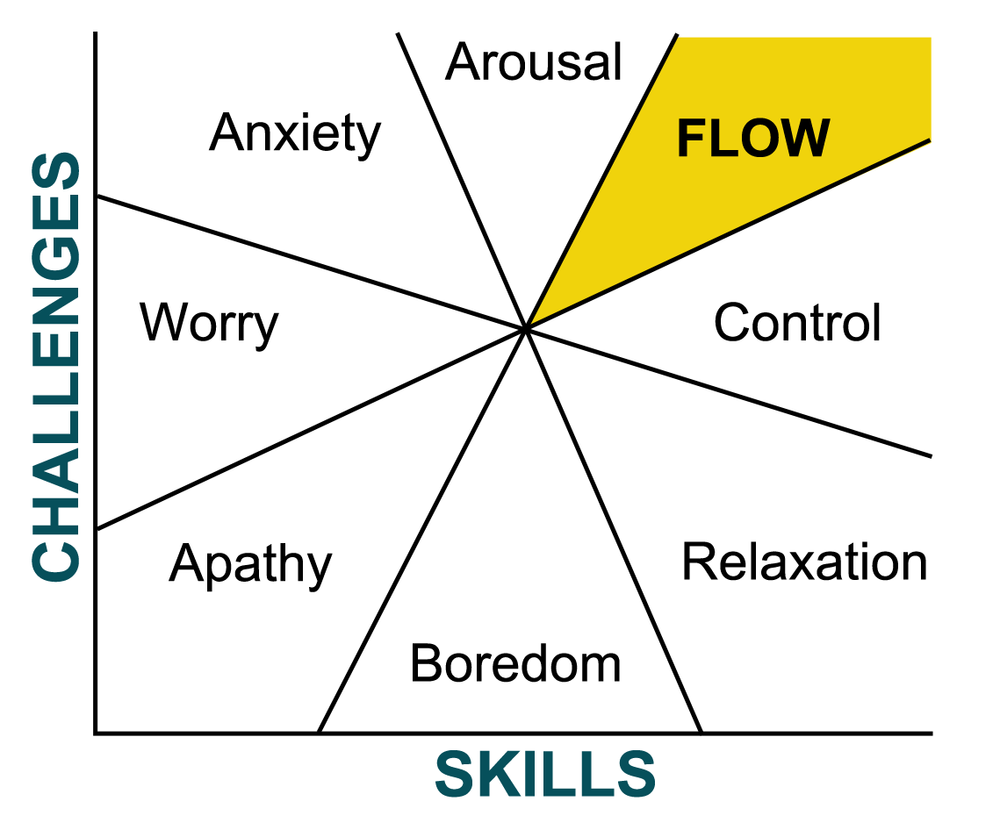

I had this book [*Flow (again)*][book-amaz] on my Kindle and couldn't remember whether I had read it
yet or not, so I decided to read it. Just now as I sat down to write this I realized I coud have
checked this blog to find out if I had read it before and lo and behold [I read it in
2015](/blog/2015-06-06-flow/). This is somewhat disheartening as while reading it this time I
had a lot of profound thoughts about it being meaningful and how I want to change some things, but
clearly I had some of these thoughts before and here I am.

I was just about at the end of my time at Flexport and living in San Francisco when I read this book
the first time. In the past three years I have moved four times including to France, I learned to
skydive, paraglide, base jump, how to ride a motorcycle. I met and married my wife, we now have a
child. I have worked at a few different places. The point of this short recollection is to remind
myself that yes I have clearly done some things, but I have not succeeding in implementing the
underlying message of this book throughout all aspects of my life.

You can read my previous entry on this book for more details about this book, it all still holds.
The book was good, I agree with the ideas, and I fully believe that flow states are basically
synonomous with happiness. I am instead going to dive into where I have and have not found flow and
why, and what I think I can do about it going forward.

I have experienced the described flow state during many different activities of varying degrees. The
short list of activities that come to mind are: BASE jumping, skydiving, running, cycling, reading,
rowing, writing, programming, mathematical research, studying/solving homework, spending time with people,
playing games, cooking, shooting. You could combine these based on some broad categories which is
done in the book, so we could get away with sports and games, intellectual, and interpersonal. There
are overlaps especially in that sports and games involve intellectual as well as often
interpersonal actions, but this is good enough for now. My best flow moments have been in sports,
especially when there is some mental aspect as well. For example I can get into a flow state by
doing steady state running, but the real good times are racing or doing a workout that requires
mental strength to push myself and to coordinate pacing. Flow occurs when your skills are balanced
against the challenge you face towards a goal. You either veer into boredom by not having a hard
enough challenge or you enter an "anxiety" state if the challenge is beyond your skills. In sports
this isn't really anxiety in so much as it usually manifests in physical failure or loss. That is a
type of anxiety in that it feels bad and is uncomfortable, but I think of as different than the
anxiety one would experience in a more mental arena such as taking a test in a subject you know
nothing about. There are some sports where the other side is very dangerous, namely BASE jumping and
skydiving. It is worth taking a detour at this point a bit more into the concepts to help clarify my
thoughts. Flow can be explained with two diagrams, the first is the simple one:

We achieve flow when the challenges we face are balanced against our skills. Naturally by partaking
in an activity we either increase our skill or increase the challenge we take on. Depending on the
activity one can stay in flow at the same skill/challenge point for a certain amount of time before
we start to move along one of the two axes. To get back into flow we have to move back along the
other axis. Take running as an example. I can estimate pretty well the pace I can race a 5k at today
where I would not have much left over at the end, but for which I could run even splits meaning that
I didn't save too much for the end (boredom) or blow up and have to slow down to finish (anxiety).
However, if I keep training, the next time I race I have to pick a new pace to run, too slow and my
new skill level was too high (I moved along the x-axis) so that I am not in flow but just bored. If
I go too fast then I took on a challenge beyond my skill level (I moved along the y-axis too much)
so that I blow up and end up in an anxious state.

The second diagram expands on this graph to give names to other regions:

This diagram is a bit misleading as it seems like anxiety only occurs when your skill level somehow
declines. The actual meaning of the axes is a bit ambigious as time is clearly somehow involved here
but is not made explicit. I don't actually like this diagram as much as I do the original, but it
helps to give some terminology for some other states. Some people are a bit more risk averse so they
might constantly find themselves in the control or relaxation regions, only sometimes breaking into
flow. This can mean always building up skills to a sufficient level before deciding to up the
challenge. Other people are more risk seeking in that they prefer to spend their time in the arousal
or anxiety states, again only occasionally breaking into flow. This means taking on challenges you
are not ready for and building up the skill necessary while working on the challenge. Neither one of
these is objectively wrong, you have to move along one axis or the other and some activities lend
themselves to one approach or the other. It is very difficult to move along the diagonal because
perfectly balancing the challenge with your skills requires a very nuanced challenge set as well as
a deep understanding of one's own skill level which is harder to know than it may seem.

The downside of taking the risk adverse approach is that one may never know where flow actually lies
because you could constantly be taking on challenges below your skill level. You can find yourself
in situations doing less than your are capable because you are trying to avoid going too far over
the edge into anxiety.

The downside of the risk seeking approach is that you might not be able to actually build up your
skill in certain disciplines if you are constantly operating over your skill level. If every time
you run a race you flame out then it can be very difficult to improve over time as you are not
getting adequate feedback to modify your training. You are constantly putting yourself in situations
you can't handle. In some activites, say chess or tennis, your opponents will probably stop playing
you because you are just putting them into boredom because your skills are not up to snuff. In other
activities, say BASE jumping or skydiving, this approach will eventually kill you.

Where am I? Well for some activities I take the risk seeking approach usually because I don't know
my limits. I prefer to lose spectacularly to help bound my upper limit rather than win and not
really know where I stand. That is, I prefer to go over the edge so I at least have a bound on where
the edge is. I have done this with rowing, running, cycling, research, programming, cooking, and
with social interactions. I have also done this a little bit in skydiving, but pulled back once I
really saw what the underlying siutation was.

In rowing I raced in a national team selection regatta during my first year rowing a single. Clearly
this was beyond my level, but I didn't really know how far outside the realm of possibility it was,
and I saw the downside as some temporary pain. I was way under experienced and outmatched, but I got
a good sense for where I stood. In running, when I was first starting to run longer distances I
raced a 5k where my race plan was go out in second place and hold on for as long as I can. My splits
were something like 4:35, 6:15, 8:05. I imploded, but I didn't have a good sense for what my
potential pace could be. I knew I was going to blow up, but I figured the best case was that I could
hold on without dying too bad and worst case I could take the overall pace and that was my benchmark
to try to beat with training. In cycling I had done a little bit of climbing in New Jersey and a few
rides in the 30-40 mile range when I moved to Pasadena. There is a ride out and back there up to the
top of Mt Wilson which involves three category 1 climbs over about 60 miles. I took two bottles of
water, got up early, and went for it. My legs were shaking during the last climb which is on the way
back, I could barely sit down without my hamstrings cramping, I wanted to stop so bad, I thought I
was going to pass out from the heat and exhaustion and just die on the side of the road. But I made
it home, and subsequently passed out face down in full kit on my living room floor. After a couple
weeks of better nutrition planning and training, I started doing that ride every week, but I didn't
know if it was really going to be hard or not without giving it a go.

I can go on with examples where I have taken the risk seeking approach in my life within these
activies and more. I know the consequences of the anxiety state in most of these activities is just
a lot of temporary pain, so I am willing to take that risk for the purpose of getting a baseline. I
don't want to be in that red zone, but I think the benefits outweight the temporary risk for
gathering information. In almost all circumstances where I went out over the edge, it set me up really
well for understanding where I was and how to train. If I went over the edge again it was because of
a miscalculation and it was almost certainly not very far over, rather just a little bit of pushing
myself into the arousal state.

In some contexts it can be hard to accurately assess your skill level and therefore you can operate
in the anxiety zone without knowing it. In fact, you can experience something like flow which is the
result of a positive outcome to an outlier situation where you overcame your lack of skill. This is
possible if you play a game against a superior opponent and they have an off day. If you play them
a few times, the skill should win out (ignoring games of pure chance) and you will realize that you
were not actually ready for that challenge. However after the first game it can be easy to delude
oneself into believing their skill level is higher than it actually is. In pure physical contests
against a clock like running, if you hit the time then you were up for the challenge in some sense.
I had one 2k on the erg where I chose a goal pace that was too aggressive for my skill level,
however I held on and hit the time. I paid for this by blacking out for a little bit, throwing up
intermittanly for a couple hours, and being sick for a couple days afterwards. So was I up to the
challenge just because I pulled it off? On one hand yes because I did it, but realistically no
because it was certainly not a flow experience. I did a different 2k on the erg where I was in flow
the whole time and it was an amazing experience. The goals were similar and the end times were
similar, but the experience was worlds apart. This focus on the actual experience is the key to
understanding the positive nature of flow as a guiding principle.

What happens when you take on a challenge that is well beyond your skill level in skydiving or BASE? You
might have a lot of fun and misassess your skill level to be on par with the challenge. Or you might
be seriously injured or die. Or you might just not have fun as you end up away from the group or
overly nervous the whole time where you fail to really accomplish the goal. The most likely event is
that it is kinda fun because it is still a jump, you partially accomplish the goal and you set
your expectations for your skill level accordingly. Besides injury or death, the worst case scenario
is the first one where you think you are better than you are.

The two most dangerous situations in skydiving and BASE jumping are overestimating your skill level
most likely due to getting away with things that are beyond you without having the mental clarity to
tell the difference, and being complacent which manifests itself in the relaxation zone on the above
graph where your skills are very high so you take challenges less seriously. Newer jumpers are
killed by overestimating their abilities whereas complacency kills the experienced.

BASE jumping, in my limited experience, is the apogee of the flow experience as it pertains to
sports. Moreover, I find sports to be the most natural avenue for flow. The concept is strongly
connected to games and can be introduced into other areas via gamification so this makes sense.

I want to put interpersonal relationships and love/sex into a different category as I don't really
compare talking to my wife with going for a run. The experience of loving and being loved lives on
its own plane. One can call this flow as in there is work required to continue to stay engaged and
enjoy the experience, but it is different than say sports or reading.

Looking back on some of the things I have done in my life where I would say I was happiest or would
love to do again, it is easy to see they were times where I was in flow. I had set goals, the goals
were not too easy but they are achievable, I worked on my skills to take on challenges which gave me
feedback and I progressed this way until hitting my goal. I then made new goals and repeated the
process.

Or the dark side hit. I met my goal, but I assumed that it was the activity itself that I really
enjoyed regardless of the goal so I tried to keep going without a concrete structure. This works for
a little bit as unstructured play within something I enjoy is fun for a while. But eventually I
start to get bored and I don't know why. Rather than setting new goals I will often start to do the
thing less and less. This is a sad state of affairs when I look back on it becaue it is obvious in
hindsight.

I am going to start setting some more concrete goals for the things I enjoy doing and be more
cognizant of the anxiety/flow/boredom states. Rather than feeling bored with something I am doing, I
need to take a step back and think about what my goals are including if I even have any. The second
time around with this book has really been much more useful. I believe that my attempts to live a
life more like what I want than just going through the motions over the past three years is a large
part of why I am ready to internalize this now.

[book-amaz]:      http://a.co/6jTXKkr
